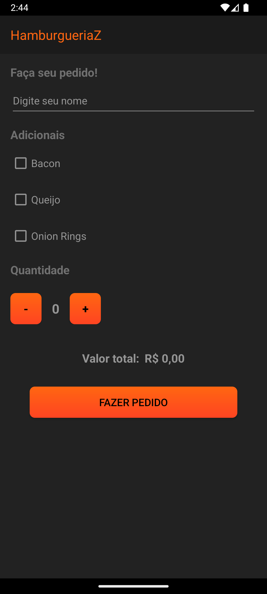
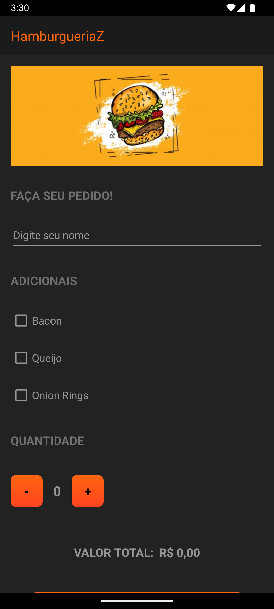

# Desenvolvimento Mobile

## Trabalho Prático 1

Arquivo **app\src\main\res\layout\main_activity.xml**:

```xml
<?xml version="1.0" encoding="utf-8"?>
<ScrollView
    xmlns:android="http://schemas.android.com/apk/res/android"
    android:layout_width="match_parent"
    android:layout_height="match_parent"
    android:background="@color/content_background_color"
    android:fillViewport="true"
    >

    <LinearLayout
        android:layout_width="match_parent"
        android:layout_height="wrap_content"
        android:orientation="vertical"
        >

        <!-- App title -->
        <TextView
            android:id="@+id/app_name"
            android:layout_width="match_parent"
            android:layout_height="wrap_content"
            android:padding="16dp"
            android:text="@string/app_name"
            android:textColor="@color/h1_color"
            android:textSize="20sp"
            android:background="@color/title_background_color"
            />

        <TextView
            android:id="@+id/intro_label"
            android:layout_width="match_parent"
            android:layout_height="wrap_content"
            android:layout_marginHorizontal="16dp"
            android:layout_marginTop="16dp"
            android:text="@string/intro_label_str"
            android:textColor="@color/h2_color"
            android:textSize="18sp"
            android:textStyle="bold"
            
            />

        <!-- Customer name -->
        <EditText
            android:id="@+id/customer_name_input"
            android:layout_width="wrap_content"
            android:layout_height="wrap_content"
            android:layout_marginHorizontal="16dp"
            android:layout_marginTop="8dp"
            android:backgroundTint="@color/text_color"
            android:hint="@string/customer_name_input_str"
            android:importantForAutofill="no"
            android:inputType="textPersonName"
            android:minWidth="400dp"
            android:minHeight="48dp"
            android:textColorHint="@color/text_color"
            android:textSize="16sp"
            />

        <!-- Additions -->
        <TextView
            android:id="@+id/additions_label"
            android:layout_width="wrap_content"
            android:layout_height="wrap_content"
            android:layout_marginHorizontal="16dp"
            android:layout_marginTop="16dp"
            android:text="@string/additions_label_str"
            android:textColor="@color/h2_color"
            android:textSize="18sp"
            android:textStyle="bold"
            />

        <CheckBox
            android:id="@+id/bacon_checkbox"
            android:layout_width="wrap_content"
            android:layout_height="wrap_content"
            android:layout_marginHorizontal="16dp"
            android:layout_marginTop="8dp"
            android:buttonTint="@color/text_color"
            android:minHeight="48dp"
            android:text="@string/bacon_checkbox_str"
            android:textColor="@color/text_color"
            android:textSize="16sp"
            />

        <CheckBox
            android:id="@+id/cheese_checkbox"
            android:layout_width="wrap_content"
            android:layout_height="wrap_content"
            android:layout_marginHorizontal="16dp"
            android:layout_marginTop="8dp"
            android:buttonTint="@color/text_color"
            android:minHeight="48dp"
            android:text="@string/cheese_checkbox_str"
            android:textColor="@color/text_color"
            android:textSize="16sp"
            />

        <CheckBox
            android:id="@+id/onion_rings_checkbox"
            android:layout_width="wrap_content"
            android:layout_height="wrap_content"
            android:layout_marginHorizontal="16dp"
            android:layout_marginTop="8dp"
            android:buttonTint="@color/text_color"
            android:minHeight="48dp"
            android:text="@string/onion_rings_checkbox_str"
            android:textColor="@color/text_color"
            android:textSize="16sp"
            />

        <!-- Quantity -->
        <TextView
            android:id="@+id/quantity_label"
            android:layout_width="wrap_content"
            android:layout_height="wrap_content"
            android:layout_marginHorizontal="16dp"
            android:layout_marginTop="16dp"
            android:text="@string/quantity_label_str"
            android:textColor="@color/h2_color"
            android:textSize="18sp"
            android:textStyle="bold"
            />

        <LinearLayout
            android:layout_width="wrap_content"
            android:layout_height="wrap_content"
            android:orientation="horizontal"
            android:layout_marginHorizontal="16dp"
            android:layout_marginVertical="24dp"
            >

            <Button
                android:id="@+id/decrement_button"
                android:layout_width="48dp"
                android:layout_height="48dp"
                android:layout_gravity="center"
                android:background="@drawable/button_gradient"
                android:text="@string/decrement_button_str"
                android:textColor="@color/button_text_color"
                android:textSize="18sp"
                android:textStyle="bold"
                />

            <TextView
                android:id="@+id/quantity_view"
                android:layout_width="wrap_content"
                android:layout_height="wrap_content"
                android:layout_gravity="center"
                android:layout_marginHorizontal="8dp"
                android:padding="8dp"
                android:text="@string/quantity_view_str"
                android:textColor="@color/text_color"
                android:textSize="20sp"
                android:textStyle="bold"
                />

            <Button
                android:id="@+id/increment_button"
                android:layout_width="48dp"
                android:layout_height="48dp"
                android:layout_gravity="center"
                android:background="@drawable/button_gradient"
                android:text="@string/increment_button_str"
                android:textColor="@color/button_text_color"
                android:textSize="18sp"
                android:textStyle="bold"
                />
        </LinearLayout>

        <!-- Total value -->
        <LinearLayout
            android:layout_width="wrap_content"
            android:layout_height="wrap_content"
            android:layout_gravity="center"
            android:orientation="horizontal"
            android:layout_margin="16dp"
            >

            <TextView
                android:id="@+id/total_value_label"
                android:layout_width="wrap_content"
                android:layout_height="wrap_content"
                android:text="@string/total_value_label_str"
                android:textColor="@color/text_color"
                android:textSize="18sp"
                android:textStyle="bold"
                />

            <TextView
                android:id="@+id/total_value_view"
                android:layout_width="wrap_content"
                android:layout_height="wrap_content"
                android:layout_marginStart="8dp"
                android:text="@string/total_value_view_str"
                android:textColor="@color/text_color"
                android:textSize="18sp"
                android:textStyle="bold"
                />
        </LinearLayout>

        <!-- End button -->
        <Button
            android:id="@+id/place_order_button"
            android:layout_width="wrap_content"
            android:layout_height="wrap_content"
            android:layout_gravity="center"
            android:layout_margin="16dp"
            android:paddingHorizontal="48dp"
            android:background="@drawable/button_gradient"
            android:minWidth="320dp"
            android:text="@string/place_order_button_str"
            android:textColor="@color/button_text_color"
            android:textSize="16sp"
            />
    </LinearLayout>
</ScrollView>
```

Arquivo **app\src\main\res\values\colors.xml**:

```xml
<?xml version="1.0" encoding="utf-8"?>
<resources>
    <color name="title_background_color">#1B1B1B</color>
    <color name="content_background_color">#222222</color>
    <color name="h1_color">#FF6611</color>
    <color name="h2_color">#707070</color>
    <color name="text_color">#959595</color>
    <color name="button_text_color">#010101</color>
</resources>
```

Arquivo **app\src\main\res\values\strings.xml**:

```xml
<resources>
    <string name="app_name">HamburgueriaZ</string>
    <string name="intro_label_str">Faça seu pedido!</string>
    <string name="customer_name_input_str">Digite seu nome</string>
    <string name="additions_label_str">Adicionais</string>
    <string name="bacon_checkbox_str">Bacon</string>
    <string name="cheese_checkbox_str">Queijo</string>
    <string name="onion_rings_checkbox_str">Onion Rings</string>
    <string name="quantity_label_str">Quantidade</string>
    <string name="decrement_button_str">-</string>
    <string name="quantity_view_str">0</string>
    <string name="increment_button_str">+</string>
    <string name="total_value_label_str">Valor total:</string>
    <string name="total_value_view_str">R$ 0,00</string>
    <string name="place_order_button_str">Fazer pedido</string>
</resources>
```

Arquivo **app\src\main\res\drawable\button_gradient.xml**:

```xml
<?xml version="1.0" encoding="utf-8"?>
<shape xmlns:android="http://schemas.android.com/apk/res/android">
    <gradient
        android:angle="-76"
        android:startColor="#FF6611"
        android:endColor="#FF4422"
        android:type="linear"
        />

    <corners
        android:radius="8dp"
        />
</shape>
```

Imagem da **Interface** gerada:



## Trabalho Prático 2

Alterações do arquivo **app\src\main\res\layout\main_activity.xml**:

```xml
<!-- Banner logo -->
<ImageView
    android:id="@+id/intro_image"
    android:layout_width="wrap_content"
    android:layout_height="150dp"
    android:layout_marginHorizontal="16dp"
    android:layout_marginTop="16dp"
    android:contentDescription="@string/intro_image_str"
    android:scaleType="centerCrop"
    android:src="@drawable/logo"
    />

<TextView
    android:id="@+id/intro_label"
    android:layout_width="match_parent"
    android:layout_height="wrap_content"
    android:layout_marginHorizontal="16dp"
    android:layout_marginTop="16dp"
    android:text="@string/intro_label_str"
    android:textColor="@color/h2_color"
    android:textSize="18sp"
    android:textStyle="bold"
    style="@style/EstiloTexto"
    />

<!-- Additions -->
<TextView
    android:id="@+id/additions_label"
    android:layout_width="wrap_content"
    android:layout_height="wrap_content"
    android:layout_marginHorizontal="16dp"
    android:layout_marginTop="16dp"
    android:text="@string/additions_label_str"
    android:textColor="@color/h2_color"
    android:textSize="18sp"
    android:textStyle="bold"
    style="@style/EstiloTexto"
    />

<!-- Quantity -->
<TextView
    android:id="@+id/quantity_label"
    android:layout_width="wrap_content"
    android:layout_height="wrap_content"
    android:layout_marginHorizontal="16dp"
    android:layout_marginTop="16dp"
    android:text="@string/quantity_label_str"
    android:textColor="@color/h2_color"
    android:textSize="18sp"
    android:textStyle="bold"
    style="@style/EstiloTexto"
    />

<!-- Total value -->
<LinearLayout
    android:layout_width="wrap_content"
    android:layout_height="wrap_content"
    android:layout_gravity="center"
    android:orientation="horizontal"
    android:layout_margin="16dp"
    >

    <TextView
        android:id="@+id/total_value_label"
        android:layout_width="wrap_content"
        android:layout_height="wrap_content"
        android:text="@string/total_value_label_str"
        android:textColor="@color/text_color"
        android:textSize="18sp"
        android:textStyle="bold"
        style="@style/EstiloTexto"
        />

    <TextView
        android:id="@+id/total_value_price"
        android:layout_width="wrap_content"
        android:layout_height="wrap_content"
        android:layout_marginStart="8dp"
        android:text="@string/total_value_view_str"
        android:textColor="@color/text_color"
        android:textSize="18sp"
        android:textStyle="bold"
        style="@style/EstiloTexto"
        />
</LinearLayout>
```

Alterações do arquivo **app\src\main\res\values\strings.xml**:

```xml
<string name="intro_image_str">Banner com a logo do projeto.</string>
```

Arquivo **app\src\main\res\values\themes.xml**:

```xml
<?xml version="1.0" encoding="utf-8"?>
<resources>

    <style name="Theme.HamburgueriaZ" parent="Theme.AppCompat.DayNight.NoActionBar">
        <item name="android:windowBackground">@color/content_background_color</item>
        <item name="android:textColor">@color/text_color</item>
    </style>

    <style name="EstiloTexto">
        <item name="android:layout_width">wrap_content</item>
        <item name="android:layout_height">wrap_content</item>
        <item name="android:gravity">center_vertical</item>
        <item name="android:textAllCaps">true</item>
        <item name="android:textSize">15sp</item>
        <item name="android:paddingTop">16dp</item>
        <item name="android:paddingBottom">16dp</item>
    </style>
</resources>
```

Nova imagem da **Interface** gerada:



## Trabalho Prático 3


```java
public class MainActivity {
    
    private final int BURGER_PRICE = 20; 
    private EditText customerName;
    private CheckBox bacon, cheese, onionRings;
    private TextView orderSummary;

    private void MainActivity() {

        customerName = findViewById(R.id.input_customer_name);
        bacon = findViewById(R.id.bacon_checkbox);
        cheese = findViewById(R.id.cheese_checkbox);
        onionRings = findViewById(R.id.onion_rings_checkbox);
        totalValue = findViewById(R.id.total_value_price);
        
        Button placeOrder = findViewById(R.id.place_order_button);
        
        placeOrder.setOnClickListener(v ->placeOrder());
    }

    private void placeOrder() {
        String name = customerNome.getText().toString();
        
        Array adds = [
            bacon => [marked => isChecked(), price => 2],
            cheese => [marked => isChecked(), price => 2],
            onionRings => [marked => isChecked(), price => 3]
        ];

        int totalPrice = calculatePrice(adds);
        createOrderSummary(name, adds, totalPrice)
    }

    private int calculatePrice(Array adds) {
        int price = BURGER_PRICE;

        for (var add in adds) {
            if (add.marked) = price += add.price;
        }

        return price * value;
    }

    private void createOrderSummary(String name, Array adds, int totalPrice) {
        // Criar um trecho de código xml abaixo do botão place order assim:

        ```xml
        <!-- Order summary -->
        <TextView
            android:id="@+id/order_summary_label"
            android:layout_width="wrap_content"
            android:layout_height="wrap_content"
            android:layout_marginHorizontal="16dp"
            android:layout_marginTop="16dp"
            android:text="@string/order_summary_label_str"
            android:textColor="@color/h2_color"
            android:textSize="18sp"
            android:textStyle="bold"
            style="@style/EstiloTexto"
            />

        <TextView
            android:layout_width="wrap_content"
            android:layout_height="wrap_content"
            android:layout_marginHorizontal="16dp"
            android:layout_marginTop="8dp"
            android:text="Nome do cliente: %s\nTem Bacon? %s\nTem Queijo? %s\nTem Onion Rings? %s\nQuantidade: %d\nPreço final: R$ %d,00"
            android:textColor="@color/text_color"
            android:textSize="16sp"
            />
        ```
    }
}
```

## Trabalho Prático 4
